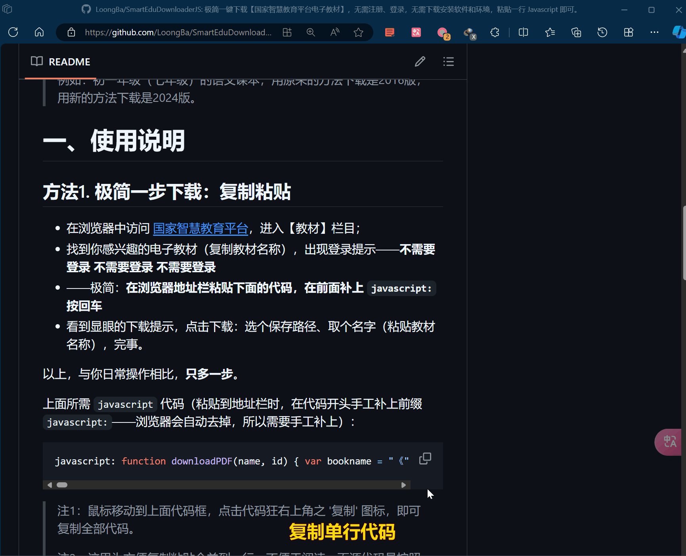

# 极简一步下载电子教材

## SmartEduDownloaderJS

极简一步下载【**国家智慧教育平台电子教材**】，**无需注册、登录**，**无需下载安装软件和环境**，**粘贴一行** Javascript **代码即可**。

> 这是 **【我与孩子一起学编程】系列** 的内容。
> 
> 该系列没什么特别的计划，来自于**日常陪伴孩子学习编程的点点滴滴**。
> 
> 所以，**你可以**用来**解决具体问题**，也可以用于**学习编程**。
> 
> 如果感兴趣，**可以细看后面的内容**——**非常非常简单，没有什么高深的东东**，但我**尽可能把细节讲清楚**，方便不同年龄的小朋友。## 

## 特别声明

> **本项目代码出于学习的目的，对相关网站主体的权利、电子书籍的版权等等不构成任何威胁和侵权行为，切勿用于其它用途，更不能用于牟利。**

虽然代码很简单，功能也没什么大不了，但**应该注意的还是要注意**。

**关于法律问题的简单提醒：**

> 考虑到法律相关问题，**主要针对中小学（九年制义务教育）的内容**，其它内容未经测试，也**不建议扩大范围**。
> 
> 另外，**本代码并未涉及爬虫**，**未用非正常手段访问服务器**。
> 
> 对于学习编程的大小朋友，切记**注意学习相关法律知识**，**不要被无下限的营销内容所鼓动**，误以为营销宣传的那些行为都是合法的，**避免《从入门到入狱》**。
> 
> ——**尤其网络安全领域**。

# 更新说明：

## Ver 1.2 解决了新版本的教材下载问题：用老的方法下载不到最新版本。

## 注意：下载 2024 新版教材需要<u>先登录</u>，不登录可以下载但是老版本——绝大部分教材没有新老版本一说。

>  简单看了一下，推测是官方用最简单的方法打了个“补丁”。
> 
> 例如：初一年级（七年级）的语文课本，用原来的方法下载是2016版，用新的方法下载是2024版（需登录）。


# 一、使用说明

## 方法1. 极简一步下载：复制粘贴

- 在浏览器中访问 [国家智慧教育平台](https://basic.smartedu.cn/)，进入【教材】栏目；
- 找到你感兴趣的电子教材（复制教材名称），出现登录提示——**不需要登录 不需要登录 不需要登录** 除非对应教材有2024新版则需要登录
- ——极简：**在浏览器地址栏粘贴下面的代码，在前面补上 `javascript:` 按回车**
- 看到显眼的下载提示，点击下载：选个保存路径、取个名字（粘贴教材名称），完事。

以上，与你日常操作相比，**只多一步**。

上面所需 `javascript` 代码（粘贴到地址栏时，在代码开头手工补上前缀`javascript:`——浏览器会自动去掉，所以需要手工补上）：

```javascript
javascript: function downloadPDF(name, id) { var bookname = "《" + name + "》"; var pdfPlayer = document.getElementById("pdfPlayerFirefox"); var pdfPath = null; if (pdfPlayer) { var pdfUrl = pdfPlayer.src.match(/file=([^&]+)/)[1]; pdfPath = new URL(pdfUrl).pathname; console.log(pdfPath); } if (!pdfPath) pdfPath = `/edu_product/esp/assets_document/${id}.pkg/pdf.pdf`; const hide = (c) => { const e = document.getElementsByClassName(c); if (e && e.length > 0 && e[0]) e[0].style.display = "none"; }; hide("fish-modal-content"); hide("fish-modal-mask"); hide("fish-modal-wrap"); const bread = document.getElementsByClassName("web-breadcrumb")[0]; bread.style.fontSize = '30px'; bread.innerHTML = "SmartEduDownloaderJS v1.2 源码更新地址：<br /><a href='http://github.com/LoongBa/SmartEduDownloaderJS' target='_blank'>爱学习的龙爸 Gitee</a> | <a href='http://gitee.com/LoongBa/SmartEduDownloaderJS' target='_blank'>Github</a><br /> <span style='color:red'>请点击链接下载教材 PDF 文件，<br />正常情况三个链接均有效：</span><br /> "; var next = bread.nextElementSibling; if (next) next.style.display = 'none'; for (let i = 1; i <= 3; i++) { var base = `https://r${i}-ndr.ykt.cbern.com.cn`; var link = document.createElement('a'); link.href = `${base}${pdfPath}`; link.download = name + '.pdf';      /*保存文件时，文件名自动按照教材名字取名，但因为浏览器限制（跨域）可能无效*/ link.target = '_blank';             /*上一句无效时，新窗口打开*/ link.textContent = bookname + ` 链接${i} `; link.style = "color:blue"; link.style.textDecoration = 'underline'; link.style.cursor = 'pointer'; link.onclick = () => navigator.clipboard.writeText(bookname).then(() => { console.log('复制书名到剪切板成功。'); }).catch(err => { console.error('复制书名到剪切板失败:', err); }); bread.appendChild(link); bread.appendChild(document.createElement('br')); if (i == 3) return link; /* 默认返回第三个连接，用于后续自动下载等 */ } console.log("⨳⨳⨳ 请点击链接下载教材 PDF 文件，正常情况三个链接均有效。⨳⨳⨳"); } var url = window.location.href.match(/contentId=([^&]+)/)[1]; downloadPDF(document.title, url);/*.click();*/
```

> 注1：鼠标移动到上面代码框，点击代码狂右上角之 '复制' 图标，即可复制全部代码。
> 
> 注2：这里为方便复制粘贴合并到一行，不便于阅读。而源代码是按照 javascript 标准格式化的，可以在线查看，或复制、Clone 到本地编辑环境中查看。

操作过程如下：



**注意：**


## 方法2. 进阶——不想每次粘贴 的方法：添加到收藏夹，不必每次粘贴

如果要下载很多教材，每次都复制粘贴这段 `javascript` 代码，**很麻烦，怎么办？**

### 2.1 把代码保存到收藏夹（只需一次）

1. 添加新收藏（按 `Ctrl-Shift-O` 打开收藏夹，再点 ”创建“ 图标，或直接按 `Ctrl-D`），
   取名字如 【下载电子教材】；

2. 粘贴代码，保存，完事。
   
   ——切记：**代码开头手别漏了 `javascript:`**

### 2.2 使用收藏夹的快捷操作

在要下载教材的页面，点选收藏夹中的 【下载电子教材】（上一步取的名字），完事。

## 方法3. 研究性学习——开发人员工具 F12

有朋友比较熟悉按 F12 打开 `开发人员工具`，也可以把上面的 `javascript` 代码粘贴到 `控制台` 然后运行。

## 显然最简单的方法是创建标签/收藏。

# 二、背景说明

## 1. 简单介绍

国家智慧教育平台 全称：【[国家智慧教育公共服务平台](https://www.smartedu.cn/)】。

其中中小学内容部分又叫做【[国家中小学智慧教育平台](https://basic.smartedu.cn/)】，因为涉及九年制义务教育的教材，按照国家《中华人民共和国义务教育法》之规定，以及2020年2月14日教育部《[关于发布中小学国家课程教材电子版链接的通告](https://www.gov.cn/xinwen/2020-02/14/content_5478551.htm)》将各中小学教材编写出版单位提供的**免费电子版教材**链接统一予以公布，才有了下载电子版教材之说。


其中，我一直从[人民教育出版社的官网](http://www.pep.com.cn/)下载小学课本电子版。后来大概是在2022年，数学教材问题引起的重新修改四年级以后的数学教材，人教社官网上下载不了涉及调整的教材。而后，下载地址从 http://bp.pep.com.cn/jc 改为了现在可用的 https://jc.pep.com.cn/ 。

另外，同期由**教育部教育技术与资源发展中心**（**中央电化教育馆**）主导建设维护的**国家智慧教育公共服务平台**也多次改版、完善，收录了包括人民教育出版社在内的**多家出版单位的电子教材**，成为更完整、权威的资源平台。这里暂不展开。

但这里之所以提到人教社，因为从家长和学生角度，**人教社公众号和小程序更好用**：

1. **方便手机、平板**等移动设备查看和使用；

2. **小程序支持点读**：语文、英语 都支持 “**指到哪里读哪里**”，妈妈再也不用担心我的学习了。

作为家长和学生，真心**感谢国家、感谢教育部、感谢相关出版机构**。

## 2. 事情起因

一次见到有位非常耐心的爸爸，把整个网站中涉及九年义务教育的所有电子教材的名字、链接收集整理到一个 Excel 文件中，方便自行下载。👍👍👍

**非常有爱，非常有耐心，非常感谢！**

正是因为看到这位爸爸的辛苦付出，我带正在学 Python 的孩子写了段简单的代码用于下载电子教材，见另外的一篇 TODO: 《SmartEduDownloader by Python》，以及支持批量下载的 TODO: 《SmartEduDownloader by Python with Playwright》。

我们的目的是带孩子一起编程，手动的方式不是我们的追求。

> **懒人推动世界进步**。
> 
> ——鲁先生

**我们都是懒人——善于用头脑偷懒的【懒人】**。

另外，后来又陆续看到很多 UP主，分享自己的方法（手动）、程序（下载运行），于是才打算把这部分内容分享出来。目的有三：

1. 一则，方便孩子和小伙伴们学习；

2. 二则，实则本代码用起来更方便；

3. 三则，后续对比不同实现方式，帮助孩子把相关知识的来龙去脉弄清楚，更扎实一些。

## 3. 不要被营销号、培训机构套路

这里还是要啰嗦一下，因为**有太多盯着家长钱包、你我钱包的营销号和培训机构**：

> 【爬虫】技术没什么特别，只是**那些营销号、培训机构喜欢拿【爬虫】来说事**，搞得**好像只有 Python 才能搞定**或者**是 Python 的优势**，**学了就如何如何了不起，不学就如何如何吃亏**一样。而且，真要做好【爬虫】或者说【自动化测试】等还是需要认真掌握正则表达式、HTML、Javascript 和 DOM 等知识。
> 
> PS：其实吧，Perl 和 正则表达式 才是文本处理方面的老祖宗，而后来在 java、javascript、C# 以及 Python 等语言中，也越来越加强了对正则表达式的内置支持。
> 
> **——不是说 Python 不好，而是反对过度夸大**。

## 4. 本代码改为自动下载

可以不用“点击”就可以自动下载，最后一行代码末尾去掉 .click() 的注释即可：

```javascript
downloadPDF(document.title, url);/*.click();*/
改为：
downloadPDF(document.title, url).click();
```

## 5. 感谢语言大师 ChatGPT

> 当时 2022年12月，后来陆续有了越来越多，不过一直以 Github Copilot 为主力。

我也是现学 Python，代码的主体部分是请 ChatGPT 写的，然后进行重构、加上适当的细节，第一个版本前后不到 10 分钟。

再然后，用 PlayWright 实现批量下载，也是请 ChatGPT 封装了一个函数，在上一步重构过的代码基础上调用新的函数来实现，前后 20 分钟左右。

> 我主力用付费的 Github Copilot，同时开通了免费的 CodeWhisperor、CodeGeex，偶尔对照看看。后续可能会写篇专题简单介绍，毕竟现有的文章视频已经很多了，应该不必多此一举。