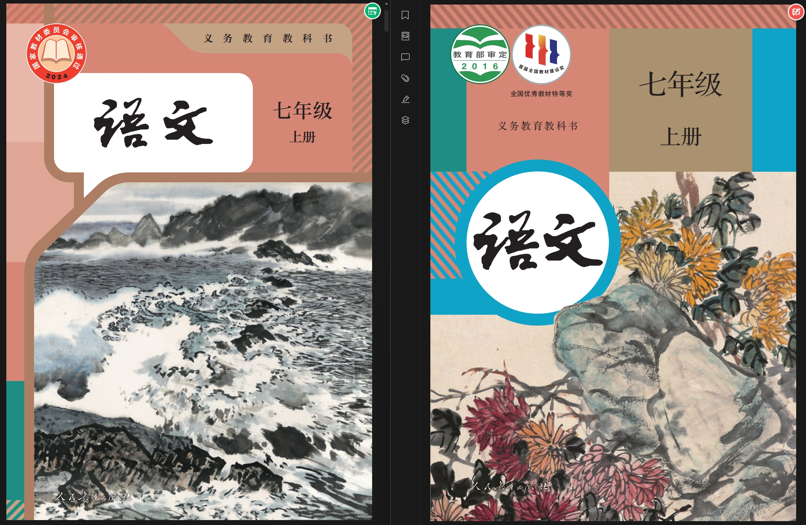
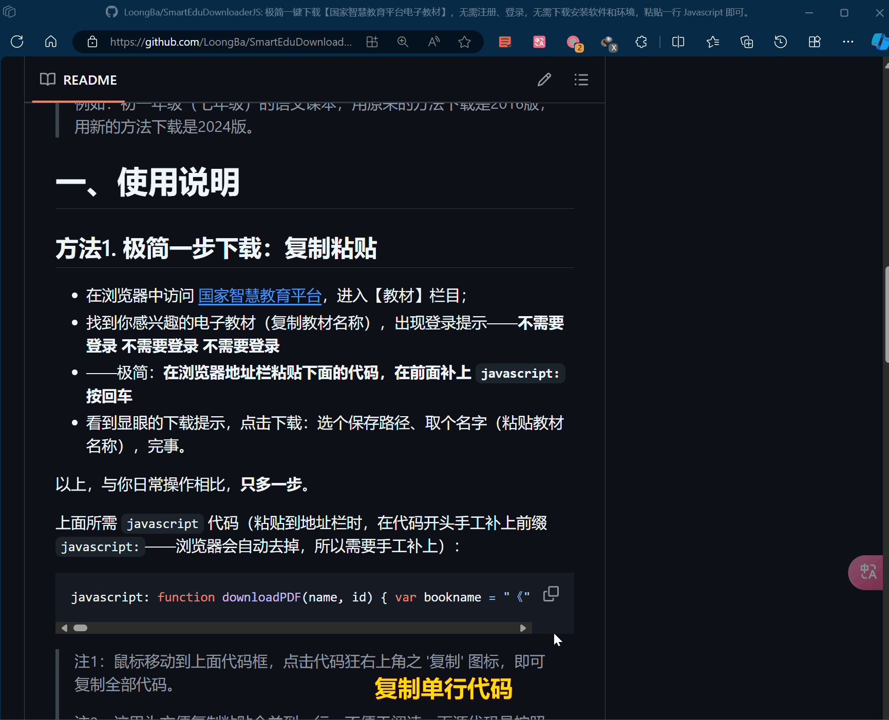
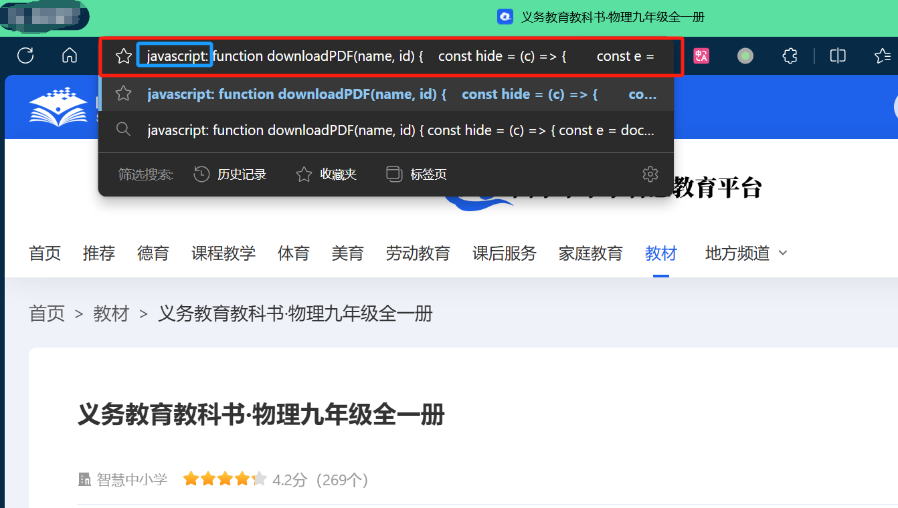
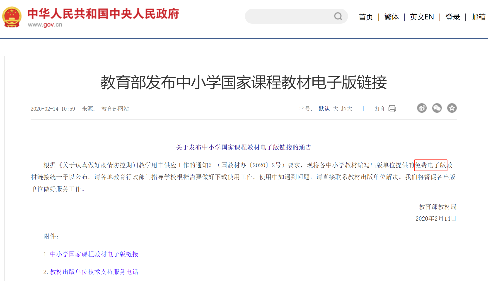

# 极简一步下载电子教材

## SmartEduDownloaderJS

极简一步下载【**国家智慧教育平台电子教材**】，**无需下载安装软件和环境**，**粘贴一行** Javascript **代码即可**。

> **登录说明**：老版本教材**无需登录**即可下载；2024 新版本教材及平台改版后的新 CDN 下载**需要先登录**（需携带登录态生成的鉴权头）。

> 这是 **【我与孩子一起学编程】系列** 的内容。
> 
> 该系列没什么特别的计划，来自于**日常陪伴孩子学习编程的点点滴滴**。
> 
> 所以，**你可以**用来**解决具体问题**，也可以用于**学习编程**。
> 
> 如果感兴趣，**可以细看后面的内容**——**非常非常简单，没有什么高深的东东**，但我**尽可能把细节讲清楚**，方便不同年龄的小朋友。## 

## 特别声明

> **本项目代码出于学习的目的，对相关网站主体的权利、电子书籍的版权等等不构成任何威胁和侵权行为，切勿用于其它用途，更不能用于牟利。**

虽然代码很简单，功能也没什么大不了，但**应该注意的还是要注意**。

**关于法律问题的简单提醒：**

> 考虑到法律相关问题，**主要针对中小学（九年制义务教育）的内容**，其它内容未经测试，也**不建议扩大范围**。
> 
> 另外，**本代码并未涉及爬虫**，**未用非正常手段访问服务器**。
> 
> 对于学习编程的大小朋友，切记**注意学习相关法律知识**，**不要被无下限的营销内容所鼓动**，误以为营销宣传的那些行为都是合法的，**避免《从入门到入狱》**。
> 
> ——**尤其网络安全领域**。

# 更新说明：

## Ver 1.2 解决了新版本的教材下载问题：用老的方法下载不到最新版本。

## 注意：下载 2024 新版教材需要<u>先登录</u>，不登录可以下载但是老版本——绝大部分教材没有新老版本一说。

>  简单看了一下，推测是官方用最简单的方法打了个“补丁”。
> 
> 例如：初一年级（七年级）的语文课本，用原来的方法下载是2016版，用新的方法下载是2024版（需登录）。



# 一、使用说明

## 方法1. 极简一步下载：复制粘贴

- 在浏览器中访问 [国家智慧教育平台](https://basic.smartedu.cn/)，进入【教材】栏目；
- 找到你感兴趣的电子教材（复制教材名称），**老版本教材无需登录**；**2024 新版本教材 / 平台改版后的新 CDN 需要先登录**（下载需携带登录态生成的鉴权头）
- ——极简：**在浏览器地址栏粘贴下面的代码，在前面补上 `javascript:` 按回车**
- 看到显眼的下载提示，点击下载：选个保存路径、取个名字（粘贴教材名称），完事。

以上，与你日常操作相比，**只多一步**。

上面所需 `javascript` 代码（粘贴到地址栏时，在代码开头手工补上前缀`javascript:`——浏览器会自动去掉，所以需要手工补上）：

```javascript
javascript:function checkLogin(){var e=document.querySelector(".user-avatar, .user-name, .header-user, .avatar"),t=document.querySelector('.login-btn, .login-button, [data-action="login"]'),o=localStorage.getItem("token")||localStorage.getItem("access_token"),n=document.cookie.includes("token")||document.cookie.includes("session");return!!(e||o||n)||!t}function showToast(e,t){var o=document.getElementById("smartedu-toast");o&&o.remove();var n=document.createElement("div");n.id="smartedu-toast",n.style.cssText="position:fixed;top:20px;right:20px;padding:16px 24px;border-radius:8px;font-size:16px;font-weight:500;z-index:99999;box-shadow:0 4px 12px rgba(0,0,0,.15);max-width:400px;cursor:pointer;";var r={info:{bg:"#e3f2fd",color:"#1565c0",border:"#90caf9",icon:"ℹ️"},warning:{bg:"#fff3e0",color:"#e65100",border:"#ffcc80",icon:"⚠️"},error:{bg:"#ffebee",color:"#c62828",border:"#ef9a9a",icon:"❌"},success:{bg:"#e8f5e9",color:"#2e7d32",border:"#a5d6a7",icon:"✅"}},a=r[t]||r.info;n.style.backgroundColor=a.bg,n.style.color=a.color,n.style.border="2px solid "+a.border,n.innerHTML='<span style="font-size:20px;margin-right:8px">'+a.icon+"</span>"+e,n.onclick=function(){n.remove()},document.body.appendChild(n),setTimeout(function(){n.parentNode&&n.remove()},5e3)}function highlightLoginBtn(){for(var e=[".login-btn",".login-button",'[data-action="login"]',".header-login",".user-login"],t=null,o=0;o<e.length;o++)try{if(t=document.querySelector(e[o]))break}catch(e){}if(!t)for(var n=document.querySelectorAll('button, a, div[role="button"], span[role="button"]'),r=0;r<n.length;r++){var a=n[r].textContent.trim();if(a.includes("登录")||a.includes("Login")){t=n[r];break}}if(t){if(t.style.cssText+=";border:3px solid #ff6b35 !important;animation:smartedu-pulse 1.5s ease-in-out infinite !important;position:relative",t.scrollIntoView({behavior:"smooth",block:"center"}),!document.getElementById("smartedu-anim")){var i=document.createElement("style");i.id="smartedu-anim",i.textContent="@keyframes smartedu-pulse{0%,100%{transform:scale(1)}50%{transform:scale(1.05)}}",document.head.appendChild(i)}return!0}return!1}function handleNotLoggedIn(){if(showToast("请先登录后再下载教材","warning"),!highlightLoginBtn()){var e=document.createElement("div");e.style.cssText="position:fixed;top:50%;left:50%;transform:translate(-50%,-50%);background:white;padding:32px;border-radius:16px;box-shadow:0 8px 32px rgba(0,0,0,.2);z-index:99998;text-align:center;max-width:400px",e.innerHTML='<div style="font-size:48px;margin-bottom:16px">🔐</div><h3 style="margin:0 0 12px;color:#333">需要先登录</h3><p style="margin:0 0 20px;color:#666;font-size:14px">下载电子教材需要登录国家智慧教育平台账号。</p><button onclick="this.parentElement.remove()" style="background:#1976d2;color:white;border:none;padding:10px 24px;border-radius:6px;cursor:pointer">我知道了</button>',document.body.appendChild(e)}}function getPdfInfo(){var e=document.getElementById("pdfPlayerFirefox");if(e&&e.src){var t=e.src.match(/file=([^&#]+)/),o=e.src.match(/headers=([^&#]+)/);if(t){var n=decodeURIComponent(t[1]),r=null;if(o)try{r=JSON.parse(decodeURIComponent(o[1]))}catch(e){console.warn("解析 headers 失败:",e)}return console.log("PDF URL:",n),console.log("Auth Headers:",r),{url:n,headers:r}}}return null}async function downloadPdfWithAuth(e,t){if(!e||!e.url)return showToast("无法获取 PDF 地址","error"),!1;showToast("正在下载...","info",1e4);try{var o={method:"GET",cache:"reload"};if(e.headers){var n=Object.assign({},e.headers);delete n.range,delete n.Range,o.headers=n}var r=await fetch(e.url,o);if(!r.ok)throw new Error("下载失败: "+r.status);var a=await r.blob();if(a.size<100)throw new Error("下载内容异常: "+a.size+" B");var i=URL.createObjectURL(a),l=document.createElement("a");return l.href=i,l.download=t+".pdf",document.body.appendChild(l),l.click(),document.body.removeChild(l),URL.revokeObjectURL(i),showToast("下载完成","success"),!0}catch(e){return console.error("下载失败:",e),showToast("下载失败: "+e.message,"error"),!1}}function downloadPDF(e,t){var o="《"+e+"》",n=getPdfInfo();if(!n)return showToast("无法获取 PDF 下载地址","error"),null;["fish-modal-content","fish-modal-mask","fish-modal-wrap"].forEach(function(e){var t=document.getElementsByClassName(e);t&&t.length>0&&t[0]&&(t[0].style.display="none")});var r=document.getElementsByClassName("web-breadcrumb")[0];if(!r)return showToast("页面结构异常","error"),null;r.style.fontSize="30px",r.innerHTML="SmartEduDownloaderJS v2.2<br><a href='https://github.com/LoongBa/SmartEduDownloaderJS' target='_blank'>Github</a> | <a href='https://gitee.com/LoongBa/SmartEduDownloaderJS' target='_blank'>Gitee</a><br><span style='color:red'>点击链接下载教材 PDF：</span><br>";var a=r.nextElementSibling;a&&(a.style.display="none");var i=document.createElement("a");i.href="#",i.textContent=o+" 点击下载 ",i.style="color:blue;text-decoration:underline;cursor:pointer;font-size:18px;font-weight:bold",i.onclick=function(t){t.preventDefault(),downloadPdfWithAuth(n,e),navigator.clipboard.writeText(o).then(function(){console.log("复制书名到剪切板成功")}).catch(function(e){console.error("复制书名到剪切板失败:",e)})},r.appendChild(i),r.appendChild(document.createElement("br"));var l=document.createElement("span");l.style.cssText="color:#666;font-size:12px;word-break:break-all",l.textContent="地址: "+n.url,r.appendChild(l),r.appendChild(document.createElement("br"));var d=document.createElement("a");d.href="#",d.textContent="返回 ",d.style="color:green;text-decoration:underline;cursor:pointer;font-size:16px;font-weight:bold",d.onclick=function(e){e.preventDefault(),location.reload()},r.appendChild(d);var c=document.createElement("span");return c.style.cssText="color:#888;font-size:12px;",c.textContent="（点击刷新当前页）",r.appendChild(c),console.log("SmartEduDownloader: 下载链接就绪"),i}var url=window.location.href.match(/contentId=([^&]+)/);if(url)if(checkLogin()){var link=downloadPDF(document.title,url[1]);link&&showToast("下载链接已就绪，点击即可下载","success")}else handleNotLoggedIn();else showToast("无法获取教材 ID","error");
```

> 注1：鼠标移动到上面代码框，点击代码狂右上角之 '复制' 图标，即可复制全部代码。
> 
> 注2：这里为方便复制粘贴合并到一行，不便于阅读。而源代码是按照 javascript 标准格式化的，可以在线查看，或复制、Clone 到本地编辑环境中查看。

操作过程如下：



**注意：**



## 方法2. 进阶——不想每次粘贴 的方法：添加到收藏夹，不必每次粘贴

如果要下载很多教材，每次都复制粘贴这段 `javascript` 代码，**很麻烦，怎么办？**

### 2.1 把代码保存到收藏夹（只需一次）

1. 添加新收藏（按 `Ctrl-Shift-O` 打开收藏夹，再点 ”创建“ 图标，或直接按 `Ctrl-D`），
   取名字如 【下载电子教材】；

2. 粘贴代码，保存，完事。
   
   ——切记：**代码开头手别漏了 `javascript:`**

### 2.2 使用收藏夹的快捷操作

在要下载教材的页面，点选收藏夹中的 【下载电子教材】（上一步取的名字），完事。

## 方法3. 研究性学习——开发人员工具 F12

有朋友比较熟悉按 F12 打开 `开发人员工具`，也可以把上面的 `javascript` 代码粘贴到 `控制台` 然后运行。

## 方法4. 浏览器插件（推荐）：Chrome / Edge

不想每次粘贴代码？本仓库提供 **Chrome / Edge 浏览器插件**（Manifest V3），安装一次，以后打开教材页面右下角自动出现【教材】下载按钮。

### 4.1 安装（开发者模式加载）

1. 下载本仓库代码（Clone 或 Download ZIP），确保 `extension/` 目录完整；
2. 打开浏览器扩展管理页：
   - Chrome：地址栏输入 `chrome://extensions/`
   - Edge：地址栏输入 `edge://extensions/`
3. 打开右上角【开发者模式】开关；
4. 点击【加载已解压的扩展程序】，选择本仓库的 `extension` 文件夹；
5. 安装完成，工具栏出现 SmartEduDownloader 图标。

### 4.2 使用

1. 打开教材详情页（`basic.smartedu.cn/...`），打开教材在线阅读（PDF 预览）；
2. 页面右下角出现【教材】浮动按钮，点击；
3. 弹出下载面板：
   - **老版本教材**：直接点击【下载教材 PDF】即可（无需登录）；
   - **新版本教材**：需先登录（未登录时会高亮登录按钮并提示）；
4. 点击【返回】刷新当前页，恢复正常浏览。

> 插件与地址栏粘贴脚本使用同一套逻辑（`SmartEduDownloader.js` v2.2），二者任选其一即可。

## 显然最简单的方法是创建标签/收藏。

# 二、背景说明

## 1. 简单介绍

国家智慧教育平台 全称：【[国家智慧教育公共服务平台](https://www.smartedu.cn/)】。

其中中小学内容部分又叫做【[国家中小学智慧教育平台](https://basic.smartedu.cn/)】，因为涉及九年制义务教育的教材，按照国家《中华人民共和国义务教育法》之规定，以及2020年2月14日教育部《[关于发布中小学国家课程教材电子版链接的通告](https://www.gov.cn/xinwen/2020-02/14/content_5478551.htm)》将各中小学教材编写出版单位提供的**免费电子版教材**链接统一予以公布，才有了下载电子版教材之说。



其中，我一直从[人民教育出版社的官网](http://www.pep.com.cn/)下载小学课本电子版。后来大概是在2022年，数学教材问题引起的重新修改四年级以后的数学教材，人教社官网上下载不了涉及调整的教材。而后，下载地址从 http://bp.pep.com.cn/jc 改为了现在可用的 https://jc.pep.com.cn/ 。

另外，同期由**教育部教育技术与资源发展中心**（**中央电化教育馆**）主导建设维护的**国家智慧教育公共服务平台**也多次改版、完善，收录了包括人民教育出版社在内的**多家出版单位的电子教材**，成为更完整、权威的资源平台。这里暂不展开。

但这里之所以提到人教社，因为从家长和学生角度，**人教社公众号和小程序更好用**：

1. **方便手机、平板**等移动设备查看和使用；

2. **小程序支持点读**：语文、英语 都支持 “**指到哪里读哪里**”，妈妈再也不用担心我的学习了。

作为家长和学生，真心**感谢国家、感谢教育部、感谢相关出版机构**。

## 2. 事情起因

一次见到有位非常耐心的爸爸，把整个网站中涉及九年义务教育的所有电子教材的名字、链接收集整理到一个 Excel 文件中，方便自行下载。👍👍👍

**非常有爱，非常有耐心，非常感谢！**

正是因为看到这位爸爸的辛苦付出，我带正在学 Python 的孩子写了段简单的代码用于下载电子教材，见另外的一篇 TODO: 《SmartEduDownloader by Python》，以及支持批量下载的 TODO: 《SmartEduDownloader by Python with Playwright》。

我们的目的是带孩子一起编程，手动的方式不是我们的追求。

> **懒人推动世界进步**。
> 
> ——鲁先生

**我们都是懒人——善于用头脑偷懒的【懒人】**。

另外，后来又陆续看到很多 UP主，分享自己的方法（手动）、程序（下载运行），于是才打算把这部分内容分享出来。目的有三：

1. 一则，方便孩子和小伙伴们学习；

2. 二则，实则本代码用起来更方便；

3. 三则，后续对比不同实现方式，帮助孩子把相关知识的来龙去脉弄清楚，更扎实一些。

## 3. 不要被营销号、培训机构套路

这里还是要啰嗦一下，因为**有太多盯着家长钱包、你我钱包的营销号和培训机构**：

> 【爬虫】技术没什么特别，只是**那些营销号、培训机构喜欢拿【爬虫】来说事**，搞得**好像只有 Python 才能搞定**或者**是 Python 的优势**，**学了就如何如何了不起，不学就如何如何吃亏**一样。而且，真要做好【爬虫】或者说【自动化测试】等还是需要认真掌握正则表达式、HTML、Javascript 和 DOM 等知识。
> 
> PS：其实吧，Perl 和 正则表达式 才是文本处理方面的老祖宗，而后来在 java、javascript、C# 以及 Python 等语言中，也越来越加强了对正则表达式的内置支持。
> 
> **——不是说 Python 不好，而是反对过度夸大**。

## 4. 本代码改为自动下载

可以不用“点击”就可以自动下载，最后一行代码末尾去掉 .click() 的注释即可：

```javascript
downloadPDF(document.title, url);/*.click();*/
改为：
downloadPDF(document.title, url).click();
```

## 5. 感谢语言大师 ChatGPT

> 当时 2022年12月，后来陆续有了越来越多，不过一直以 Github Copilot 为主力。

我也是现学 Python，代码的主体部分是请 ChatGPT 写的，然后进行重构、加上适当的细节，第一个版本前后不到 10 分钟。

再然后，用 PlayWright 实现批量下载，也是请 ChatGPT 封装了一个函数，在上一步重构过的代码基础上调用新的函数来实现，前后 20 分钟左右。

> 我主力用付费的 Github Copilot，同时开通了免费的 CodeWhisperor、CodeGeex，偶尔对照看看。后续可能会写篇专题简单介绍，毕竟现有的文章视频已经很多了，应该不必多此一举。